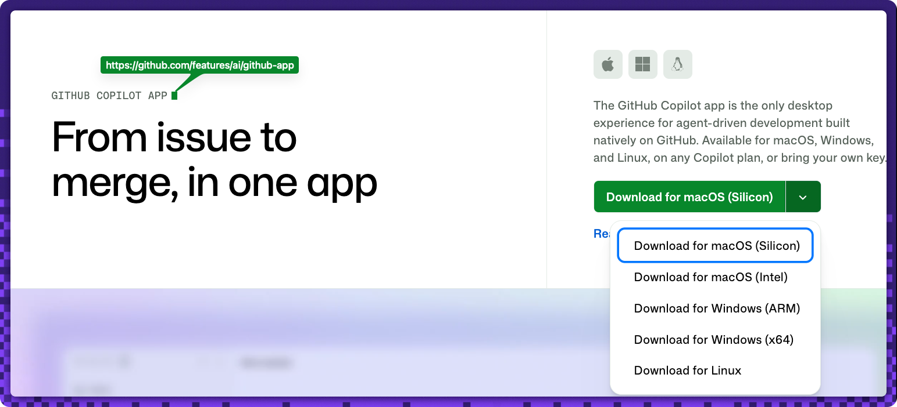
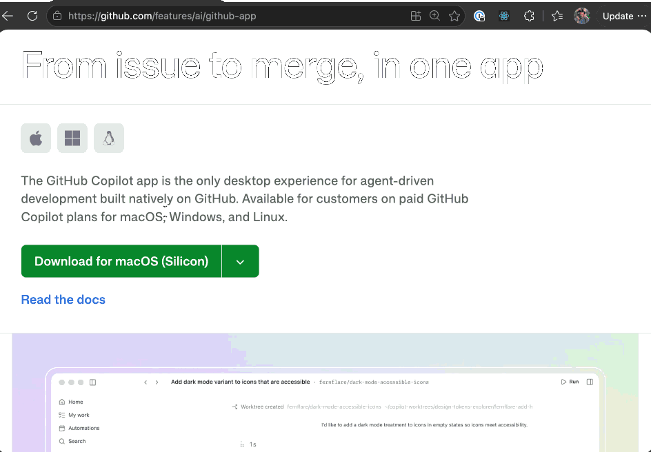

## Step 1: Create an issue from chat in the Copilot App

Welcome, {{login}}! 👋 Every good change starts as an idea. In this exercise you'll take one idea — a small bookmarks app — all the way from a chat message to a merged pull request, entirely inside the **GitHub Copilot App**.

### 📖 Theory: from chat to a work item

The GitHub Copilot App gives you **quick chat** for lightweight tasks and a connected view of your repository's issues and pull requests — all without leaving the app. A great first move is to turn a rough idea into a tracked **issue** so planning and execution live in the same place.

<!-- image: app install and sign-in screen -->

<!-- image: quick chat drafting the bookmarks app issue -->

The app you'll build stores each bookmark as two things: the **original URL** and a locally generated **short slug** (a display alias — there's no shortener service or backend).

### Running this exercise in the Copilot App

You can complete every step inside the app using a **three-panel** layout:

| Panel | What it shows |
| --- | --- |
| **1 · Issue** | The walkthrough issue where each step's instructions and grading feedback appear as comments. |
| **2 · Codespace editor** | The repository code — used for the light edits in Steps 2 and 5, and to watch the session in Step 3. |
| **3 · App preview** | A browser canvas on the Codespace's **public** port, rendering the running app for the Step 5 demo. |

Two commit patterns keep ceremony proportional to the change:

- **Light edit → `main`** (Steps 2 and 5): a single-file change committed straight to the default branch.
- **Feature work → issue-driven session → PR** (Step 3): the real build, delivered on its own branch and merged in Step 4.

> [!IMPORTANT]
> Do **Step 2 before starting the Step 3 session.** The build session branches from `main` and inherits the custom instructions, so the client-boundary rule must already be there.

### Resetting or retrying

- Each check re-runs automatically when you re-trigger it (edit the issue, push the file again, or reopen/update the PR).
- If a step's feedback shows a red ❌, follow the **Having trouble?** notes in that step's comment and try again — there's no penalty for retries.
- To start completely fresh, delete your copy and copy the exercise again.

#### References

- [Getting started with the Copilot App](https://docs.github.com/en/copilot/how-tos/github-copilot-app/getting-started)
- [Managing issues and pull requests with the Copilot App](https://docs.github.com/en/copilot/how-tos/github-copilot-app/getting-started)

### ⌨️ Activity 1: Install and connect (guided, not graded)

> [!NOTE]
> This activity is **app-only** and can't be graded — there's no repository signal for install or sign-in. Complete it to unlock the graded work in Activity 2.

To use the GitHub Copilot app, the first step — as you might imagine — is to install it. Versions are available for Windows, macOS, and Linux. Let's install the app, authenticate, and add your exercise repository to the app.

1. In a browser, open the landing page for the GitHub Copilot app: **https://github.com/features/ai/github-app**.

   

1. Download the app for your platform and install it following the instructions provided on the landing page.

   

1. Open the app once it's installed.
1. Select **Sign in to GitHub** and follow the prompts to authenticate.
1. Connect **your copy** of this exercise repository (`{{full_repo_name}}`).
1. Open **quick chat** and confirm Copilot can summarize the repository context.

<!-- image: connected repository shown in the app with quick chat open -->

### ⌨️ Activity 2: Create the app issue from chat (graded)

1. In quick chat, ask Copilot to draft an issue to build the bookmarks app. For example:

   > Draft a GitHub issue titled "Build the bookmarks app". In the body, describe an Astro app that saves each **bookmark** as its **original URL** plus a locally generated short **slug**, persisted in the browser. Then create the issue in this repository.

1. Make sure the created issue:
   - has a **title that mentions bookmarks** (for example, `Build the bookmarks app`), and
   - has a **body that names both** the **original URL** and the **short slug**.

<!-- image: created issue with the title marker applied -->

> [!TIP]
> If chat can't see repository context, re-check that **your copy** of the exercise repository is connected before drafting the issue.

Having trouble? 🤷
 

- Make sure the issue you created is a **new issue**, separate from this walkthrough issue.
- The title must contain the word **bookmark** (any case).
- The body must mention both a **URL** and a **slug**, and be more than a sentence long.
- Edit the issue title or body to re-run the check.
- Still stuck on the app itself? See [Getting started with the Copilot App](https://docs.github.com/en/copilot/how-tos/github-copilot-app/getting-started).

