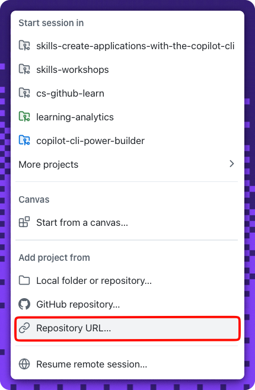
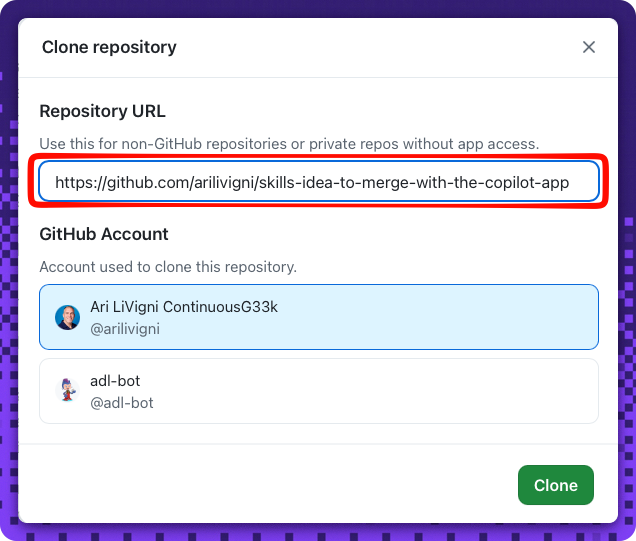

## Step 1: Create an issue from a session in the Copilot App

Welcome, {{login}}! 👋 Every good change starts as an idea. In this exercise you'll take one idea — a small bookmarks app — all the way from a session to a merged pull request, entirely inside the **GitHub Copilot App**.

### 📖 Theory: from a session to a work item

The GitHub Copilot App gives you **agent sessions** that run against your checked-out repository, plus a connected view of its issues and pull requests — all without leaving the app. A great first move is to turn a rough idea into a tracked **issue** so planning and execution live in the same place.

The app you'll build stores each bookmark as two things: the **original URL** and a locally generated **short slug** (a display alias — there's no shortener service or backend).

### Running this exercise in the Copilot App

You'll complete every step **inside the app**, using three surfaces:

| Surface | What it's for |
| --- | --- |
| **Sessions** | Drive the work — start a **New session** on your checked-out repository, and use an **issue-driven session** (which runs on its own branch) for the build in Step 3. |
| **Browser canvas** | The right side panel renders **live GitHub pages** — the README, your issue, the pull request, and the running app — with clickable links and buttons. Just ask the agent, for example: `open the main readme of this repository in a browser canvas`. |
| **Files & Changes tabs + editor canvas** | Every session has built-in **Files** and **Changes** tabs for the working tree and diff. For the light hand-edits, open a file in a **lightweight editor canvas** and save it. |

<!-- image: the app's three surfaces — a session, a browser canvas, and the Files/Changes tabs -->

Two commit patterns keep ceremony proportional to the change:

- **Light edit → `main`** (Steps 2 and 4): a single-file change made in the editor canvas and committed straight to the default branch.
- **Feature work → issue-driven session → PR** (Step 3): the real build, delivered on its own branch and merged in Step 3.

> [!IMPORTANT]
> Do **Step 2 before starting the Step 3 session.** The build session branches from `main` and inherits the custom instructions, so the client-boundary rule must already be there.

### Resetting or retrying

- Each check re-runs automatically when you re-trigger it (edit the issue, push the file again, or reopen/update the PR).
- If a step's feedback shows a red ❌, follow the **Having trouble?** notes in that step's comment and try again — there's no penalty for retries.
- To start completely fresh, delete your copy and copy the exercise again.

#### References

- [Getting started with the Copilot App](https://docs.github.com/en/copilot/how-tos/github-copilot-app/getting-started)
- [Managing issues and pull requests with the Copilot App](https://docs.github.com/en/copilot/how-tos/github-copilot-app/managing-issues-and-pull-requests)

### ⌨️ Activity 1: Install and connect

> [!NOTE]
> This activity is **app-only** and can't be graded — there's no repository signal for install or sign-in. Complete it to unlock the graded work in Activity 2.

To use the GitHub Copilot app, the first step — as you might imagine — is to install it. Versions are available for Windows, macOS, and Linux. Let's install the app, authenticate, and add your exercise repository to the app.

1. In a browser, open the landing page for the GitHub Copilot app: **https://github.com/features/ai/github-app**.

   

1. Download the app for your platform and install it following the instructions provided on the landing page.

   

1. Open the app once it's installed.
1. Select **Sign in to GitHub** and follow the prompts to authenticate.
1. After authenticating, add your exercise repository. Click the **+** next to **Sessions**, then choose **Repository URL…**.

   

1. Paste the clone URL for the (`{{full_repo_name}}`) repo you just created, pick your GitHub account, and select **Clone**.

   

1. Start a **New session** on your checked-out repository, then prompt the agent to sign in and bring this exercise up in the right side panel — in one shot:

   > 
   >
   > ```prompt
   > - Open a browser canvas and go to https://github.com/login
   > - Sign me in to GitHub, then open the main README of this repository
   > - Keep it open in the right side panel so I can read and click through it
   > ```

   The browser canvas has its own sign-in, so signing in here keeps the
   README (and later your issue and pull request) rendered as **live,
   logged-in pages** you can read and click through without leaving the app.

   <!-- image: exercise README open in a browser canvas -->

1. In the session, confirm Copilot can see the repository context (for example, ask it to summarize the README).

### ⌨️ Activity 2: Create the app issue from a session

1. In your session, ask Copilot to draft an issue to build the bookmarks app. For example:

   > 
   >
   > ```prompt
   > Draft a GitHub issue and create it in this repository.
   > - Title: "Build the bookmarks app"
   > - Describe an Astro app that saves each bookmark as:
   >   - its original URL, and
   >   - a locally generated short slug
   > - Bookmarks are persisted in the browser
   > ```

1. Make sure the created issue:
   - has a **title that mentions bookmarks** (for example, `Build the bookmarks app`), and
   - has a **body that names both** the **original URL** and the **short slug**.

   <!-- image: created issue with the title marker applied -->

1. Open the issue you just created in a **browser canvas** so you can keep it visible while you work through the rest of the exercise. In the app, open a browser canvas and navigate to the new issue (for example, `https://github.com/{{full_repo_name}}/issues`), then select your **Build the bookmarks app** issue.

   <!-- image: created issue open in a browser canvas -->

> [!TIP]
> If the session can't see repository context, re-check that **your copy** of the exercise repository is connected before drafting the issue.

<details>
<summary>Having trouble? 🤷</summary><br/>

- Make sure the issue you created is a **new issue**, separate from this walkthrough issue.
- The title must contain the word **bookmark** (any case).
- The body must mention both a **URL** and a **slug**, and be more than a sentence long.
- Edit the issue title or body to re-run the check.
- Still stuck on the app itself? See [Getting started with the Copilot App](https://docs.github.com/en/copilot/how-tos/github-copilot-app/getting-started).

</details>
