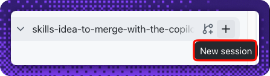
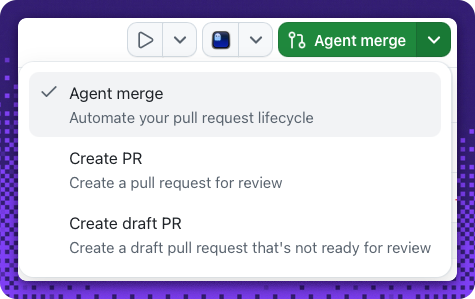
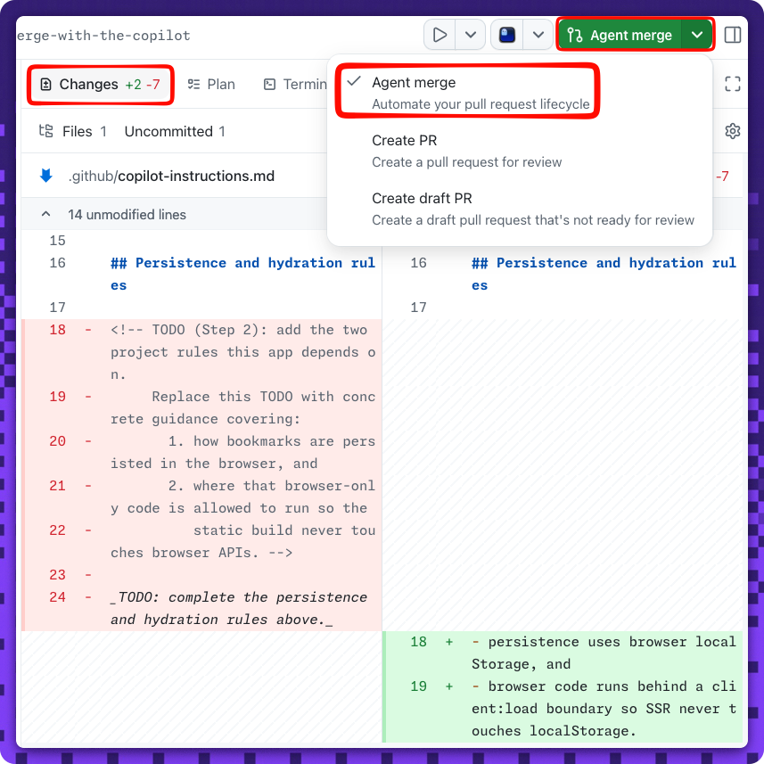

## Step 2: Set the project rules in Copilot instructions

Nice — the work item exists! 🎉 Before you build, set the ground rules so the agent follows your team's conventions from the very first line of code.

### 📖 Theory: custom instructions guide every session

A `.github/copilot-instructions.md` file gives Copilot project context it applies in **every** session in this repository. Getting the rules right now pays off when the build session runs in Step 3.

Two rules matter for this app:

- **Persistence:** bookmarks are stored in the browser using **`localStorage`**.
- **Hydration:** browser-only code must run behind a **client-side boundary** so Astro's static build never touches `localStorage` during SSR. In Astro, that's the **`client:load`** directive (or an inline `<script>`).

Even a light, single-file change is a chance to try **agent merge** — the app's action that **automates the whole pull request lifecycle**. Instead of committing straight to `main`, you make the edit in a session and let agent merge open a pull request and merge it to `main` for you. It's a gentle warm-up for the manual review-and-merge you'll do in Step 3.

> [!IMPORTANT]
> The custom instructions must be on `main` **before** you start the Step 3 build session, because that session branches from `main` and inherits these rules.

#### References

- [Customizing Copilot with repository instructions](https://docs.github.com/en/copilot/how-tos/configure-custom-instructions)
- [Astro client directives](https://docs.astro.build/en/reference/directives-reference/#client-directives)

### ⌨️ Activity 1: Set the rules and ship them with agent merge (graded)

> [!NOTE]
> This is a **light, single-file edit** made in a session — you'll prompt the agent to update the file, then use **agent merge** to open and merge the pull request to `main` for you.

1. Start a **New session** on your repository, then **prompt the agent to update `.github/copilot-instructions.md`** — replace the seeded `TODO` placeholder with the two project rules:

   

   > 
   >
   > ```prompt
   > Update .github/copilot-instructions.md: replace the TODO placeholder with the two project rules:
   > - persistence uses browser localStorage, and
   > - browser code runs behind a client:load boundary so SSR never touches localStorage.
   > Use agent merge to merge the PR and provide helpful tips
   > ```

1. **Confirm agent merge lands the change.** Your prompt asks the agent to ship the edit with **Agent merge** — approve it when prompted, or trigger it yourself from the session's action dropdown (top of the session). The app opens a pull request for your edit and **merges it to `main` automatically**.

   

   <details>
   <summary>See the change agent merge ships 👀</summary><br/>

   The pull request replaces the seeded `TODO` block with the two project rules — persistence via `localStorage` and the `client:load` boundary — before merging to `main`.

   

   </details>

> [!TIP]
> Be specific to this project (Astro + TypeScript + `localStorage` behind `client:load`). The client-boundary rule is exactly what keeps the Step 3 build from crashing at SSR.

<details>
<summary>Having trouble? 🤷</summary><br/>

- The file must contain the exact tokens **`localStorage`** and **`client:load`**.
- Remove the seeded **`TODO`** marker entirely — the check fails while any TODO remains.
- Agent merge lands the change on **`main`** for you — if the check didn't run, confirm the agent-merge pull request actually **merged** (not left open).
- Still stuck on the app itself? See [Getting started with the Copilot App](https://docs.github.com/en/copilot/how-tos/github-copilot-app/getting-started).

</details>
