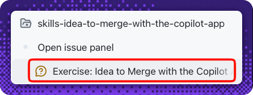

## Step 3: Build, open, and merge the pull request

The rules are set. 🛠️ Now deliver the feature the way a team really does: build it in a dedicated session, open a pull request, review it, and ship it with **agent merge** — all in one native flow in the app.

### 📖 Theory: build in a dedicated session

This is where the extra ceremony pays off. A dedicated **session** lets the agent implement the feature on its **own branch** and open a pull request — unlike the light `main` edits in Steps 2 and 4. You don't need to open the app issue first; the build prompt links it with a closing keyword.

- The session branches **from `main`**, so it inherits your Step 2 custom instructions.
- Before it starts, you set three controls from the dropdowns below the prompt: **where it runs** (a new working tree, your local repository, or a cloud sandbox), the **session mode**, and the **model** and reasoning effort (**Auto** lets the app pick).
- The **session mode** sets how much autonomy the agent has:
  - **Interactive** — the agent proposes changes and waits for your input.
  - **Plan** — the agent drafts a plan you approve before it executes.
  - **Autopilot** — the agent works end to end on its own.
- Each bookmark stores its **original URL** and a locally generated **short slug** (base62 of a hash/counter, for example). There is **no shortener service, redirect, or backend** — the slug is a display alias.
- Bookmarks persist with **`localStorage`**, accessed **only** behind a **`client:load`** boundary so the static build doesn't fail.
- When the work looks good, you review the diff and let **agent merge** open and merge the pull request for you — the same native action you used in Step 2, now on a real feature branch. Because only the **app PR** is open, there's no second PR to confuse it with.
- This exercise uses an **unprotected** branch, so the merge isn't blocked by required checks or reviews. (Required-check gating comes in a follow-on exercise.)
- Because the PR body uses a closing keyword, merging automatically **closes the linked app issue**.

> [!NOTE]
> **Why a fresh session — not the Step 2 one?** A new session cuts a branch from the **current `main`** (which now has your Step 2 instructions) and gives you a clean working tree; the build prompt links the app issue with `Closes …/issues/2`, so no closing keyword is left to chance. Reusing the Step 2 session risks a branch that's **behind `main`** — so it may miss the client-boundary rule and fail the build gate — and mixes a docs edit with a feature build. Keep it **one session per work item**. (A **nested session** is for breaking a big task into sub-tasks; this single feature doesn't need one.)

<!-- image: bookmarks UI showing an original URL and its short slug -->

<!-- image: pull request opened from the session -->

> [!IMPORTANT]
> Complete **Step 2 first.** If you start this session before the instructions are on `main`, the agent won't see the client-boundary rule and the build check below may fail.

#### References

- [Working with agent sessions in the Copilot App](https://docs.github.com/en/copilot/how-tos/github-copilot-app/agent-sessions)
- [Astro components and client directives](https://docs.astro.build/en/reference/directives-reference/#client-directives)

### ⌨️ Activity 1: Build the feature and ship it with agent merge (graded)

> [!TIP]
> You can reopen these step instructions anytime: in your session, reference the **Exercise: Idea to Merge with the Copilot App** issue (that's the walkthrough issue **#1** from your first session) to bring it back into the side panel.
>
> 

1. Start a **New session** on your repository. You don't need to open the app issue first — the prompt below already links it with a closing keyword.

   
1. Set the session controls from the dropdowns below the prompt field:
   - **Run location:** choose **a new working tree** (or your local repository) so the work lands on its own branch.
   - **Session mode:** pick **Plan** to review the agent's approach first, or **Interactive** to work step by step. Avoid **Autopilot** for this exercise so you can see each change.
   - **Model:** leave it on **Auto** unless you have a preference.

   <!-- image: session mode, model, and run-location dropdowns below the prompt -->

   Follow the work in the conversation, and use the session's **Files** and **Changes** tabs — or a **lightweight editor canvas** — to inspect or adjust files on the session branch.

   <!-- image: session running with the Files and Changes tabs -->
1. In one prompt, have the agent build the feature, **open the pull request**, walk you through the changes, and **ship it with agent merge** — the native Copilot App flow. The prompt already links your **Build the bookmarks app** issue (issue **#2**):

   > 
   >
   > ```prompt
   > Implement the bookmarks feature in src/components/Bookmarks.astro:
   > - Add a bookmark by its original URL
   > - Generate a short base62 slug for each bookmark
   > - Save both the URL and the slug to localStorage
   > - Keep all localStorage access behind a client:load boundary
   >   (or the inline <script>) so the static Astro build never
   >   touches browser APIs
   >
   > Then ship it the native way:
   > - Open a pull request with a body that includes
   >   "Closes https://github.com/{{full_repo_name}}/issues/2"
   > - Walk me through the diff so I can review the changes
   >
   > Don't just merge the pull request
   > Make sure the pull request state is correct
   > Use agent merge to merge the pull request into main and provide helpful tips
   > ```

1. **Review the diff, then let agent merge land it.** Watch the changes in the session's **Changes** tab (or a browser canvas on the PR), then confirm **Agent merge** from the session's action dropdown so the app merges the pull request into `main`. Because the PR body uses a closing keyword, merging **closes the linked app issue** automatically.

   <!-- image: opened pull request referencing the app issue -->

   <!-- image: agent merge shipping the bookmarks pull request -->

> [!TIP]
> Point `Closes #<n>` at the **app issue** (not this walkthrough issue) so the merge closes the right one automatically.

> [!TIP]
> Inside the prompt field you can reference an issue with **`#`**, pull a file into context with **`@`**, and run slash commands with **`/`** — handy for steering the agent as it builds.

<details>
<summary>Having trouble? 🤷</summary><br/>

- The PR body must contain a closing keyword and an issue number, e.g. `Closes #2`.
- `src/components/Bookmarks.astro` must reference **`localStorage`**.
- The app must build. If the build fails, make sure `localStorage` runs inside the client `<script>` / `client:load` boundary, never at the top of the component frontmatter.
- If **Agent merge** doesn't appear, open the session's action dropdown (top of the session) and select it — the same control you used in Step 2.
- Still stuck on the app itself? See [Getting started with the Copilot App](https://docs.github.com/en/copilot/how-tos/github-copilot-app/getting-started).

</details>


### ⌨️ Activity 2: Confirm the merge landed

Agent merge handled the merge in Activity 1 — now confirm it landed. You'll see **two result tables** post to this issue: the **build** check when the PR opened, and the **merge** check once agent merge completed. The merge check also **re-builds `main`**, so the exercise only advances when the shipped app still builds.

1. Confirm the pull request is **merged into `main`** (open the PR in a browser canvas, or check the **app PR** view).

   <!-- image: merged pull request in the app -->

1. Confirm the linked **app issue** is now **closed** — the closing keyword did this automatically.

   <!-- image: linked app issue automatically closed -->

<details>
<summary>Having trouble? 🤷</summary><br/>

- If the merge check hasn't posted, make sure agent merge actually **merged** the PR (not just opened it).
- The exercise won't advance if the merged app fails to build. If the build row is red, fix the code on `main` (usually a `localStorage` call outside the `client:load` / `<script>` boundary) and push the fix.
- If the app issue stays open, confirm the PR body used `Closes https://github.com/{{full_repo_name}}/issues/2` (your **Build the bookmarks app** issue) — not the walkthrough issue — then close it manually if needed.
- Still stuck on the app itself? See [Getting started with the Copilot App](https://docs.github.com/en/copilot/how-tos/github-copilot-app/getting-started).

</details>
